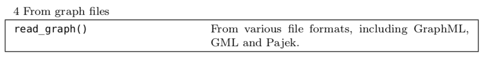

# `igraph` package {#igraph}

## Introduction

### `igraph` vs `statnet`

```{r igrphstatnet, fig.cap='`igraph` versus `statnet` from [Shizuka Lab](http://www.shizukalab.com/toolkits/sna/igraph-vs-statnet)', out.width='80%',  fig.align='center',echo=FALSE,cache=TRUE}

```

### References

- Official website (handbook): <http://igraph.org/r/>
- Tutorial: <http://kateto.net/networks-r-igraph>
- Book: <https://sites.fas.harvard.edu/~airoldi/pub/books/BookDraft-CsardiNepuszAiroldi2016.pdf>
- Datasets: 
  - https://github.com/mathbeveridge/asoiaf
  - https://networkofthrones.wordpress.com/data/
  - https://www.macalester.edu/~abeverid/thrones.html

### Preparation

```{r, echo=TRUE, message=FALSE, warning=FALSE}
#install.packages("igraph")
#install.packages("igraphdata")
library(igraph)
library(igraphdata)
```


## Create networks and basics concepts 

### Outline

- Basic introduction on network analysis using R. 
    - R package `igraph` 
        - create networks (predifined structures; specific graphs; graph models; adjustments)
        - Edge, vertex and network attributes
        - Network and node descriptions
    - R package `statnet` (ERGM,...)
- Collecting network data
    - **Web API requesting** (Twitter, Reddit, IMDB, or more)
    - Useful websites (SNAP, or more)
- Visualization 
    - static networks and dynamic networks
- Network analysis


### Create simple networks

---

- `graph(edges,n,directed,isolates)`
- `graph_from_literal`


#### `graph(edges,n,directed,isolates)`

an undirected graph with 3 edges:

```{r g1,echo=TRUE,cache=TRUE}
g1 <- graph( edges=c(1,2, 2,3, 3,1), n=3, directed=F ) 
plot(g1) 
```

---

n can be greater than number of vertices in the edge list

```{r g2, echo=TRUE,cache=TRUE}
g2 <- graph( edges=c(1,2, 2,3, 3,1), n=10 ) # now with 10 vertices, and directed by default
plot(g2)   
```

---

named vertices

```{r g3,echo=TRUE,cache=TRUE}
g3 <- graph( c("John", "Jim", "Jim", "Jill", "Jill", "John")) 
# When the edge list has vertex names, the number of nodes is not needed
plot(g3)
```

---

named vertices without edges

```{r g4,echo=TRUE,cache=TRUE}
g4 <- graph( c("John", "Jim", "Jim", "Jack", "Jim", "Jack", "John", "John"), 
             isolates=c("Jesse", "Janis", "Jennifer", "Justin") )  
# In named graphs we can specify isolates by providing a list of their names.
set.seed(1)
plot(g4, edge.arrow.size=.5, vertex.color="gold", vertex.size=15, 
     vertex.frame.color="gray", vertex.label.color="black", 
     vertex.label.cex=1.5, vertex.label.dist=2, edge.curved=0.2) 
```

#### `graph_from_literal`

Small graphs can also be generated with a description of this kind:

-  '-' for undirected tie, "+-' or "-+" for directed ties pointing left & right, 
- "++" for a symmetric tie, and ":" for sets of vertices

```{r gfl1, echo=TRUE,cache=TRUE}
plot(graph_from_literal(a---b, b---c)) # the number of dashes doesn't matter
```

---

```{r gfl2,echo=TRUE,cache=TRUE}
plot(graph_from_literal(a--+b, b+--c))
```

---

```{r gfl3,echo=TRUE,cache=TRUE}
plot(graph_from_literal(a+-+b, b+-+c)) 
```

---

a:b:c using colon to connect abc as a whole group. 
Each vertex within group a:b:c is connected to each vertex within group c:d:e

```{r gfl4,echo=TRUE,cache=TRUE}
plot(graph_from_literal(a:b:c---c:d:e))
plot(graph_from_literal(a--b:c:d))
plot(graph_from_literal(a:e--b:c:d))
```

### Creating specific graphs and graph models

---

- Specific graph
    - `make_empty_graph`
    - `make_full_graph`
    - `make_tree`
    - `make_star`
    - `make_ring`
- Graph models
    - `sample_gnm`  Erdos-Renyi random graph 
    - `sample_gnp`  Erdos-Renyi with G(n,p) specification
    - `sample_smallworld` Watts-Strogatz small-world model
    - `sample_pa` Barabasi-Albert preferential attachment model for scale-free graphs

#### Empty graph

```{r eg,echo=TRUE,cache=TRUE}
eg <- make_empty_graph(40)
plot(eg, vertex.size=10, vertex.label=NA)
```

#### Full graph

```{r fg,echo=TRUE,cache=TRUE}
fg <- make_full_graph(40)
plot(fg, vertex.size=10, vertex.label=NA)
```

#### Tree graph

```{r tr,echo=TRUE,cache=TRUE}
tr <- make_tree(40, children = 3, mode = "undirected")

plot(tr, vertex.size=10, vertex.label=NA) 
```

#### Star graph 

```{r st,echo=TRUE,cache=TRUE}
st <- make_star(40)
plot(st, vertex.size=10, vertex.label=NA) 
```

#### Ring graph

```{r rn,echo=TRUE,cache=TRUE}
rn <- make_ring(40)
plot(rn, vertex.size=10, vertex.label=NA)
```


#### Erdos-Renyi random graph 
'n' is number of nodes, 'm' is the number of edges

```{r er,echo=TRUE,cache=TRUE}
er <- sample_gnm(n=100, m=40) ####can also use erdos.renyi.game
## options include directed= and loops=
plot(er, vertex.size=6, vertex.label=NA)  
```

#### Erdos-Renyi with G(n,p) specification

```{r er1,echo=TRUE,cache=TRUE}
er <- sample_gnp(n=100, p=.02) ####can also use erdos.renyi.game
plot(er, vertex.size=6, vertex.label=NA)  
```

### Adjustments on graphs

---

- igraph object as a layer (using `+`)
- igraph object as a matrix (using `[]`)
- rewiring a graph using `rewire`, `connect.neighborhood`
- combine graphs `%du%`
- other functions

#### igraph object as a layer

```{r kite,echo=TRUE,cache=TRUE}
kite <- make_empty_graph(directed = FALSE) + vertices(LETTERS[1:10]) +
edges('A','B', 'B','D', 'C','D', 'D','E', 'E','G', 'F','G', 'G','H', 'H','I', 'I','J')
plot(kite)
```

#### igraph object as a matrix

```{r kitem,echo=TRUE,cache=TRUE}
kite[]
```

--- 

add edge

```{r kitem1,echo=TRUE,cache=TRUE}
kite['A','F']=1
kite[]
```

---

add multiple edges

```{r kitem2,echo=TRUE,cache=TRUE}
kite[-1,1]
kite[-1,1]=1
kite[] # add multiple edges or using from and to
```

---

add multiple edges using `from` and `to`

```{r kitem3,echo=TRUE,cache=TRUE}
kite[from=LETTERS[1:3],to=LETTERS[4:6]]=1
kite[]
```

---

remove edge

```{r kitem4,echo=TRUE,cache=TRUE}
kite[-1,2]=0
```


#### rewiring a graph

```{r,echo=TRUE,cache=TRUE}
set.seed(1)
plot(rn, vertex.size=10, vertex.label=NA)
```

---

'each_edge()' is a rewiring method that changes the edge endpoints to a new vertex with a probability 'prob'. And the new vertex is random variable distributed uniformly.

```{r,echo=TRUE,cache=TRUE}
rn.rewired <- rewire(rn, each_edge(prob=0.1))
plot(rn.rewired, vertex.size=10, vertex.label=NA)
```

---

Rewire to connect vertices to other vertices at a certain distance. 

```{r,echo=TRUE,cache=TRUE}
rn.neigh = connect.neighborhood(rn, 5)
plot(rn.neigh, vertex.size=8, vertex.label=NA) 
g <- make_ring(10)
plot(g)
g <- connect(g, 2)
plot(g)
```

---

combine graphs

```{r,echo=TRUE,cache=TRUE}
plot(rn %du% tr, vertex.size=10, vertex.label=NA)
```

### Edge, vertex and network attributes

---

- Consider edge, vertex as sequences []
- Consider the network as matrix []
- Neighbors [[]]
- Attributes $

#### consider edge, vertex as sequences

```{r,echo=TRUE,cache=TRUE}
plot(g4)
```

---

```{r,echo=TRUE,cache=TRUE}
E(g4) #edge list
V(g4) #vertex list
ecount(g4) # count
vcount(g4) # count
```

---

refer vertex and edges

```{r,echo=TRUE,cache=TRUE}
V(g4)[c("John","Jim")]
V(g4)[nei("Jim")] # neighbors of Jim
```

---

```{r,echo=TRUE,cache=TRUE}
E(g4)[c("John|Jim","Jim|Jack")]
E(g4,path = c("John","Jim","Jack"))
E(g4)[ "John" %--% "Jack" ]
E(g4)[ "Jim" %->% "Jack" ]
E(g4)[ from("Jim") ]
E(g4)[ to("Jim") ]
```

#### consider the network as matrix

```{r,echo=TRUE,cache=TRUE}
class(g4)
g4[] #"adjacency matrix"
g4[1,] # consider as a matrix to select 
```

---

```{r,echo=TRUE,cache=TRUE}
get.adjacency(g4) 
##explicitly getting adjacency matrix (as a sparse matrix)
get.adjacency(g4,sparse=FALSE) 
##explicitly getting adjacency matrix  --- not sparse, lets you manipulate it better
```

---

```{r,echo=TRUE,cache=TRUE}
g4[1:2,2:3]
g4[from=c("Jack","Jim","John"),to=c("Jim","Jack","John")]
```


#### neighbors

```{r,echo=TRUE,cache=TRUE}
neighbors(g4,"Jim")
g4[["Jim"]]
g4[[c("Jim","John")]] #works for multiple vertices
```

--- 

```{r,echo=TRUE,cache=TRUE}
g4[["Jim",]]
g4[[,"Jim"]]
g4[[,"Jim",edges=TRUE]]
```

#### Attributes: vertex attributes, edge attributes, graph attributes

use $ to create attributes and get attributes
```{r,echo=TRUE,cache=TRUE}
V(g4)$name # automatically generated when we created the network.
V(g4)$gender <- c("male", "male", "male", "male", "female", "female", "male")
neighbors(g4,"Jim",mode = "all")$gender
E(g4)$type <- "email" # Edge attribute, assign "email" to all edges
E(g4)$weight <- 10    # Edge weight, setting all existing edges to 10
g4 <- set_graph_attr(g4, "name", "Email Network")
```

---

see the attributes

```{r,echo=TRUE,cache=TRUE}
edge_attr(g4)
vertex_attr(g4)
graph_attr(g4)
graph_attr_names(g4)
graph_attr(g4, "name")
```

---

can remove the attribute

```{r,echo=TRUE,cache=TRUE}
g4 <- set_graph_attr(g4, "something", "A thing")
g4 <- delete_graph_attr(g4, "something")
graph_attr(g4)
```

---

Make use of these attributes

```{r,echo=TRUE,cache=TRUE}
plot(g4, edge.arrow.size=.5, vertex.label.color="black", vertex.label.dist=1.5,
     vertex.color=as.factor(V(g4)$gender) )
```

---

```{r,echo=TRUE,cache=TRUE}
plot(g4, edge.arrow.size=.5, vertex.label.color="black", vertex.label.dist=1.5,
     vertex.color=c( "pink", "skyblue")[1+(V(g4)$gender=="male")] ) 
#consider as a sequence
```

---

attributes can be combined

```{r,echo=TRUE,cache=TRUE}
plot(g4)
g4s <- igraph::simplify( g4, remove.multiple = T, remove.loops = F, 
                 edge.attr.comb=c(weight="sum", type="ignore") )
#specifies what to do with edge attributes, if remove.multiple=TRUE. In this case many edges might be mapped to a single one in the new graph, and their attributes are combined.
E(g4)$type
E(g4s)$type
E(g4)$weight
E(g4s)$weight

```

#### special attributes

make sure to avoid using these attribute names: color(e/v), layout(g), name(v),shape(v),type(v),weight(e)


### Description of igraph object

---

```{r,echo=TRUE,cache=TRUE}
g4s
```

- D or U, for a directed or undirected graph
- N for a named graph (where nodes have a name attribute)
- W for a weighted graph (where edges have a weight attribute)
- B for a bipartite (two-mode) graph (where nodes have a type attribute)
- (7 5) refer to the number of nodes and edges 
- node & edge attributes, for example: g:graph; v: vertex; e: edge;n:numeric; c:character;l:logical; x:complex 

---

```{r,echo=TRUE,cache=TRUE}
data(karate)
karate
data(macaque)
macaque
```
 


## Built networks from external sources, basic visualization and more on network descriptions

### Outline

- Get network from files (edgelist, matrix, dataframe)
- Visualization
  - Plotting parameters
  - Layouts
- Network and node descriptions
    

### Dataset

- Datasets: Download the data from [my github](https://github.com/YunranChen/STA650Lab/blob/master/lab2_igraph2/gotstark_lannister.csv). 
- The full dataset comes from <https://github.com/mathbeveridge/asoiaf>
- Analysis on the datasets: <https://www.macalester.edu/~abeverid/thrones.html>


```{r, fig.cap='Network Visualization from  [abeverid](https://www.macalester.edu/~abeverid/thrones.html)', out.width='80%', fig.align='center',echo=FALSE,cache=TRUE}

```


###  Get network from files


#### Creating network

```{r, fig.cap=' Introduction from  [`igraph` manual](https://sites.fas.harvard.edu/~airoldi/pub/books/BookDraft-CsardiNepuszAiroldi2016.pdf)', out.width='80%',  fig.align='center',echo=FALSE,cache=TRUE}

```

---


```{r, fig.cap=' Introduction from  [`igraph` manual](https://sites.fas.harvard.edu/~airoldi/pub/books/BookDraft-CsardiNepuszAiroldi2016.pdf)', out.width='80%',  fig.align='center',echo=FALSE,cache=TRUE}

```

---

```{r, fig.cap=' Introduction from  [`igraph` manual](https://sites.fas.harvard.edu/~airoldi/pub/books/BookDraft-CsardiNepuszAiroldi2016.pdf)', out.width='80%',  fig.align='center',echo=FALSE,cache=TRUE}

```

---

```{r, fig.cap=' Introduction from  [`igraph` manual](https://sites.fas.harvard.edu/~airoldi/pub/books/BookDraft-CsardiNepuszAiroldi2016.pdf)', out.width='80%',  fig.align='center',echo=FALSE,cache=TRUE}

```


```{r, fig.cap=' Introduction from  [`igraph` manual](https://sites.fas.harvard.edu/~airoldi/pub/books/BookDraft-CsardiNepuszAiroldi2016.pdf)', out.width='80%',  fig.align='center',echo=FALSE,cache=TRUE}

```


####  Get network from files

- `graph_from_adjacency_matrix()`
- `graph_from_edgelist()`
- `graph_from_data_frame()`

####  `graph_from_adjacency_matrix()`

Used for creating a small matrix. 

The networks in real world are usually large sparse matrix and stored as a edgelist.

Binary matrix:

```{r,echo=TRUE,cache=TRUE}
set.seed(2)
#sample from Bernoulli distribution with sample size 100. 
adjm <- matrix(sample(0:1, 100, replace=TRUE, prob=c(0.9,0.1)), nc=10)
adjm
g1 <- graph_from_adjacency_matrix( adjm )
set.seed(1)
plot(g1)
#default is directed
g2 <- graph_from_adjacency_matrix( adjm ,mode = "undirected")
set.seed(1)
plot(g2)
#get rid of the self-loop (in real-world maybe self-loop does not make any sense)
g3 <- graph_from_adjacency_matrix( adjm ,mode = "undirected",diag = FALSE)
set.seed(1)
plot(g3)
```

---

Sparse matrix:

```{r,echo=TRUE,cache=TRUE}
adjms=g1[]
adjms
g4=graph_from_adjacency_matrix(adjms)
set.seed(1)
plot(g4)

```

---

Weighted matrix

```{r, echo=TRUE,cache=TRUE}
set.seed(1)
adjmw <- matrix(sample(0:5, 100, replace=TRUE,
                      prob=c(0.9,0.02,0.02,0.02,0.02,0.02)), nc=10)
adjmw
g5 <- graph_from_adjacency_matrix(adjmw, weighted=TRUE)
set.seed(1)
plot(g5)
g5
E(g5)$weight
```

---

Named matrix

```{r,echo=TRUE,cache=TRUE}
rownames(adjmw)=LETTERS[1:10]
colnames(adjmw)=LETTERS[1:10]
g6 <- graph_from_adjacency_matrix(adjmw, weighted=TRUE)
set.seed(1)
plot(g6)

```

####  `graph_from_edgelist()`

 Most network datasets are stored as edgelists.
 Input is **two-column matrix** with each row defining one edge.

```{r, echo=TRUE,cache=TRUE}
gotdf=read.csv("images/gotstark_lannister.csv",stringsAsFactors = FALSE)
head(gotdf,5)
```

```{r message=FALSE, warning=FALSE,echo=TRUE}
library(dplyr)
library(tidyr)
```

```{r,echo=TRUE,cache=TRUE}
gotdf.el=gotdf%>%select(Source,Target,weight)%>%
  group_by(Source,Target)%>%
  expand(edge=c(1:weight))%>%select(-edge)
head(gotdf.el)
```

---

```{r,echo=TRUE,cache=TRUE}
## input need to be a matrix
got1=graph_from_edgelist(gotdf.el%>%as.matrix(),directed = FALSE)
got1
plot(got1,edge.arrow.size=.5, vertex.color="gold", vertex.size=3, 
     vertex.frame.color="gray", vertex.label.color="black", 
     vertex.label.cex=.5, vertex.label.dist=2, edge.curved=0.2)

```


##### Simplify the network

```{r,echo=TRUE,cache=TRUE}
el <- matrix( c("foo", "bar","foo","bar", "bar", "foobar"), nc = 2, byrow = TRUE)
graph_from_edgelist(el)%>%plot()
```

```{r,echo=TRUE,cache=TRUE}
E(got1)$weight=rep(1,ecount(got1))
got1s <- igraph::simplify( got1, remove.multiple = T, remove.loops = F, 
                 edge.attr.comb=c(weight="sum"))
plot(got1s,edge.arrow.size=.5, vertex.color="gold", vertex.size=3, 
     vertex.frame.color="gray", vertex.label.color="black", 
     vertex.label.cex=.5, vertex.label.dist=2, edge.curved=0.5,layout=layout_with_lgl)
```

##### Short name

```{r,echo=TRUE, message=FALSE, warning=FALSE,cache=TRUE}
library(stringr)
```


```{r,echo=TRUE,cache=TRUE}
nameshort=V(got1s)$name%>%
  str_split(.,"-",simplify = TRUE)%>%
  .[,1]
V(got1s)$name[1:3]
nameshort[1:3]
V(got1s)$name=nameshort
plot(got1s,edge.arrow.size=.5, vertex.color="gold", vertex.size=3, 
     vertex.frame.color="gray", vertex.label.color="black", 
     vertex.label.cex=.5, vertex.label.dist=2, edge.curved=0.5,layout=layout_with_lgl)

```

####  `graph_from_data_frame()`

Most common and useful.

d: a  data frame containing a symbolic edge list in the first two columns. Additional columns are considered as edge attributes.

vertices: A data frame with vertex metadata

```{r,echo=TRUE,cache=TRUE}
head(gotdf,5)
gotdf=gotdf%>%select(-X)
got2=graph_from_data_frame(d=gotdf,directed = FALSE)
got2
plot(got2,edge.arrow.size=.5, vertex.color="gold", vertex.size=3, 
     vertex.frame.color="gray", vertex.label.color="black", 
     vertex.label.cex=.5, vertex.label.dist=2, edge.curved=0.5,layout=layout_with_lgl)

```

##### get dataframe, matrix or adgelist from igraph object

```{r,echo=TRUE,cache=TRUE}
igraph::as_data_frame(got2)%>%head(2)
as_adjacency_matrix(got2)%>%head(2)
as_edgelist(got2)%>%head(2)
```

##### `read_graph`, `write_graph`

```{r,echo=TRUE,cache=TRUE}
## store in txt or csv or others 
write_graph(graph = got2,file = "g.txt",format = "edgelist")
read_graph(file = "g.txt",format = "edgelist",directed=F)

## store the whole graph
write_graph(got2,file = "gg",format = "pajek")
read_graph(file="gg",format="pajek")
got2
```


### Visualization 

- Plotting parameters: mapping important attributes to visual properties
- Find a good layout

```{r,echo=TRUE,cache=TRUE}
?igraph.plotting
```

####  Plotting parameters

```{r, fig.cap=' Introduction from  [Kateto tutorial](https://kateto.net/networks-r-igraph)', out.width='80%',  fig.align='center',echo=FALSE,cache=TRUE}

```

---

```{r, fig.cap=' Introduction from  [Kateto tutorial](https://kateto.net/networks-r-igraph)', out.width='80%',  fig.align='center',echo=FALSE,cache=TRUE}

```

---

```{r, fig.cap=' Introduction from  [Kateto tutorial](https://kateto.net/networks-r-igraph)', out.width='80%',  fig.align='center',echo=FALSE,cache=TRUE}

```

---

```{r,echo=TRUE,cache=TRUE}
plot(got2, vertex.color="gold", vertex.size=3, 
     vertex.frame.color="gray", vertex.label.color="black", 
     vertex.label.cex=.5, vertex.label.dist=2, edge.curved=0.5,layout=layout_with_lgl)

```

##### To make the graph look nicer

- Node color: using family name
- Node size:  degree
- Edge width: weight

```{r try,echo=TRUE,cache=TRUE}
## store the fullname
fullnames=V(got2)$name
fullnames[1:3]
#get family name
familynames=fullnames%>%str_split("-",simplify = TRUE)%>%.[,2]
familynames[familynames==""]="None"
familynames[familynames=="(guard)"]="None"
# add vertices attributes
V(got2)$familyname=familynames
V(got2)$fullname=fullnames
V(got2)$name=nameshort # first name
```

---

Set colors and legend.

- pch: plotting symbols appearing in the legend
- pt.bg: background color for point
- cex: text size
- pt.cex: point size
- ncol: number of columns of the legend
- bty: "o"-- rectangle box; "n" -- no box

```{r,echo=TRUE,cache=TRUE}
vcol=V(got2)$familyname
vcol[(vcol!="Stark")&(vcol!="Lannister")]="gray50"
vcol[vcol=="Stark"]="tomato"
vcol[vcol=="Lannister"]="gold"
V(got2)$color=vcol
V(got2)$size=igraph::degree(got2)%>%log()*4
E(got2)$width=E(got2)$weight%>%log()/2
plot(got2, vertex.label.color="black", 
     vertex.label.cex=.5, vertex.label.dist=2, edge.curved=0.5,layout=layout_with_kk)
legend("right", legend = c("Stark","Lannister","Other"), pch=21,
       col=c("tomato","gold","gray50"), pt.bg=c("tomato","gold","gray50"), pt.cex=1, cex=.8, bty="n", ncol=1)

```

--- 

Plot only labels of the nodes

```{r,echo=TRUE,cache=TRUE}
plot(got2, vertex.shape="none",vertex.label.color="black", 
     vertex.label.cex=.5, vertex.label.dist=2, edge.curved=0.5,layout=layout_with_kk)
```


####  Layouts

```{r, fig.cap=' Layouts from  [Kateto tutorial](https://kateto.net/networks-r-igraph)',  fig.align='center',echo=FALSE}
knitr::include_graphics("images/layouts.png")
```

---

Force-directed layouts: suitable for general, small to medium sized graphs. (computational complexity; based on physical analogies)

- layout_with_fr: Fruchterman-Reingold is one of the most used force-directed layout algorithms. Force-directed layouts try to get a nice-looking graph where edges are similar in length and cross each other as little as possible. As a result, nodes are evenly distributed through the chart area, and the layout is intuitive in that nodes which share more connections are closer to each other.
- layout_with_kk: Another popular force-directed algorithm that produces nice results for connected graphs is Kamada Kawai.
- layout_with_graphopt: ...

For large graphs:

- layout_with_lgl: The LGL algorithm is meant for large, connected graphs. Here you can also specify a root: a node that will be placed in the middle of the layout.
- layout_with_drl:
- layout_with_gfr:

---

- layout_with_dh:simulated annealing algorithm by Davidson and Harel

```{r,echo=TRUE,cache=TRUE}
#layout_with_dh
plot(got2, vertex.label.color="black", 
     vertex.label.cex=.5,vertex.label.dist=0.2, edge.curved=0.5,layout=layout_with_dh)
legend("right", legend = c("Stark","Lannister","Other"), pch=21,
       col=c("tomato","gold","gray50"), pt.bg=c("tomato","gold","gray50"), pt.cex=1, cex=.8, bty="n", ncol=1)

```

---

Selecting a layout automatically

- connected and vcount<=100: kk
- vcount<=1000:fr
- else: drl

```{r,echo=TRUE,cache=TRUE}
plot(got2, vertex.label.color="black", 
     vertex.label.cex=.5,vertex.label.dist=0.2, edge.curved=0.5,layout=layout.auto(got2))

```


---

Without label and color the edge.

```{r, echo=TRUE,cache=TRUE}
set.seed(2)
plot(got2, vertex.shape="none",vertex.label.color="black", 
     vertex.label.cex=.5,vertex.label.dist=0.2, edge.curved=0.5,layout=layout_with_dh)
##color the edge
got2
ecol=rep("gray50",ecount(got2))
ecol[E(got2)$source.family=="Stark"]="tomato"
ecol[E(got2)$source.family=="Lannister"]="gold"
ecol[(ecol=="tomato")&(E(got2)$target.family=="Lannister")&(!is.na(E(got2)$target.family))]="orange"
ecol[(ecol=="gold")&(E(got2)$target.family=="Stark")&(!is.na(E(got2)$target.family))]="orange"

set.seed(2)
plot(got2, vertex.shape="none",vertex.label.color="black", edge.color=ecol,
     vertex.label.cex=.5,vertex.label.dist=0.2, edge.curved=0.5,layout=layout_with_dh)
legend("right", legend = c("Stark","Lannister","Stark-Lannister","Other"),
       col=c("tomato","gold","orange","gray50"), lty=rep(1,4), cex=.8, bty="n", ncol=1)

```

#### layout is not deterministic

Different runs will result in slightly different configurations. **Saving the layout** or **set.seed** allows us to get the exact same result multiple times, which can be helpful if you want to plot the time evolution of a graph, or different relationships – and want nodes to stay in the same place in multiple plots.

```{r,echo=TRUE,cache=TRUE}
set.seed(1)
l=layout_with_dh(got2)
plot(got2, vertex.shape="none",vertex.label.color="black", 
     vertex.label.cex=.5,vertex.label.dist=0.2, edge.curved=0.5,layout=l)

```

---

rescale

- `norm_coords`
- `rescale=F`
- can use `layout=l*2`

```{r,echo=TRUE,cache=TRUE}
l=layout_with_fr(got2)
l <- norm_coords(l, ymin=-1, ymax=1, xmin=-1, xmax=1) #default -- scaled
plot(got2, vertex.shape="none",vertex.label.color="black", 
     vertex.label.cex=.5,vertex.label.dist=0.2, edge.curved=0.5,layout=l,rescale=F)

```

---

Will introduce interactive r packages next time. 

```{r,echo=TRUE,cache=TRUE}
par(mfrow=c(2,2), mar=c(0,0,0,0))
plot(got2, vertex.shape="none",vertex.label.color="black", 
     vertex.label.cex=.5,vertex.label.dist=0.2, edge.curved=0.5,layout=l*0.5,rescale=F)
plot(got2, vertex.shape="none",vertex.label.color="black", 
     vertex.label.cex=.5,vertex.label.dist=0.2, edge.curved=0.5,layout=l*0.8,rescale=F)
plot(got2, vertex.shape="none",vertex.label.color="black", 
     vertex.label.cex=.5,vertex.label.dist=0.2, edge.curved=0.5,layout=l*1,rescale=F) 
plot(got2, vertex.shape="none",vertex.label.color="black", 
     vertex.label.cex=.5,vertex.label.dist=0.2, edge.curved=0.5,layout=l*2,rescale=F)
#dev.off()

```


###  Network and node descriptions

---

- Density: `edge_density`
- Degree: `degree`
- centrality and centralization: 
    - `centr_degree`  
    - `closeness`, `centr_clo`
    - `eigen_centrality`, `centr_eigen`
    - `betweenness`, `edge_betweenness`, `centr_betw`
- reciprocity,transitivity,diameter,...
    
#### Density

The proportion of present edges from all possible ties.

```{r,echo=TRUE,cache=TRUE}
edge_density(got2, loops=F)
ecount(got2)/(vcount(got2)*(vcount(got2)-1))*2 #for an undirected network
```


#### Node degrees

'degree' has a mode of 'in' for in-degree, 'out' for out-degree, and 'all' or 'total' for total degree. 

Notice the graph is undirected. So there is no difference under different parameter setting.

```{r,echo=TRUE,cache=TRUE}
deg <- igraph::degree(got2, mode="all")
hist(deg, breaks=1:vcount(got2)-1, main="Histogram of node degree")
deg.dist <- degree_distribution(got2, cumulative=T, mode="all")
plot( x=0:max(deg), y=1-deg.dist, pch=19, cex=1.2, col="orange", 
      xlab="Degree", ylab="Cumulative Frequency")
```

#### centrality and centralization

Who is the most important character?

- Degree
- Closeness
- Eigenvector
- Betweeness

---

Degree (number of ties).

Normalization should be the max degree the network can get

```{r,echo=TRUE,cache=TRUE}
igraph::degree(got2, mode="in",loops = F)%>%sort(decreasing = TRUE)%>%.[1:5]
#Notice this is undirected network, the choice of mode does not matter
centr_degree(got2, mode="in", normalized=T,loops = F)$res%>%sort(decreasing = TRUE)%>%.[1:5]
centr_degree(got2, mode="all", normalized=T,loops = F)$res%>%sort(decreasing = TRUE)%>%.[1:5]

#Pay attention to whether allowing self-loop or not
# Normalization may differ due to the setting
centr_degree(got2, mode="all", normalized=T,loops = F)$theoretical_max
centr_degree(got2, mode="in", normalized=T,loops = F)$theoretical_max
centr_degree(got2, mode="in", normalized=T,loops = T)$theoretical_max
```

---

Closeness (centrality based on distance to others in the graph)
Inverse of the node's average geodesic distance to others in the network

```{r,echo=TRUE,cache=TRUE}
#whether to include weight or not
#If a graph has edge attribute weight, the weight will be automatically took into consideration
igraph::closeness(got2, mode="all", weights=NA) %>%sort(decreasing = TRUE)%>%.[1:5]
igraph::closeness(got2, mode="all")%>%sort(decreasing = TRUE)%>%.[1:5]
centr_clo(got2, mode="all", normalized=T)$res %>%sort(decreasing = TRUE)%>%.[1:5]
```

--- 

Eigenvector (centrality proportional to the sum of connection centralities)
Values of the first eigenvector of the graph adjacency matrix

```{r,echo=TRUE,cache=TRUE}

eigen_centrality(got2, directed=F, weights=NA)$vector%>%sort(decreasing = TRUE)%>%.[1:5]
eigen_centrality(got2, directed=F)$vector%>%sort(decreasing = TRUE)%>%.[1:5]

centr_eigen(got2, directed=F, normalized=T) $vector%>%sort(decreasing = TRUE)%>%.[1:5]
```

--- 

Betweenness (centrality based on a broker position connecting others)
(Number of geodesics that pass through the node or the edge)

```{r,echo=TRUE,cache=TRUE}
igraph::betweenness(got2, directed=F, weights=NA)%>%sort(decreasing = TRUE)%>%.[1:5]
igraph::betweenness(got2, directed=F)%>%sort(decreasing = TRUE)%>%.[1:5]
edge_betweenness(got2, directed=F, weights=NA)%>%sort(decreasing = TRUE)%>%.[1:5]
centr_betw(got2, directed=F, normalized=T)$res%>%sort(decreasing = TRUE)%>%.[1:5]

```

#### Other properties

- transitivity
- reciprocity
- clustering coefficient
- ...


## Paths, communitites and related visualization

### Outline

- R package `igraph` 
    - Paths
        - Paths, distances and diameter
        - Components
        - Transitivity and reciprocity
        - Max-flow and min-cut
    - Communities
        - Pre-defined clusters
        - Different algorithms
    - Visualization
        - Color the paths
        - Plotting clusters
        - Plotting dendrograms
        - Mark groups
    


### Datasets

#### Load the datasets

```{r, echo=TRUE, message=FALSE, warning=FALSE}
data(USairports)
data(karate)
```

```{r,echo=TRUE,cache=TRUE}
?USairports
?karate
```

#### Preprocess

```{r,echo=TRUE,cache=TRUE}
USairports
#should have no self-loop
sum(which_loop(USairports))
USairports <- igraph::simplify(USairports, remove.loops = TRUE, remove.multiple = FALSE)
sum(which_loop(USairports))
#different carrier and aircraft types leading to multiple graphs
USairports[["RDU","JFK",edges=TRUE]][[1]][[1:5]]
#simplify
air <- igraph::simplify(USairports, edge.attr.comb =list(Departures = "sum", Seats = "sum", Passengers = "sum",Distance="mean", "ignore"))
air
air[["RDU","JFK",edges=TRUE]]
```


### Paths, distances and diameter

#### Paths
#####  Select specific paths

Select specific paths

```{r,echo=TRUE,cache=TRUE}
#select length 1 path
air[[from="RDU",to="BOS",edges=TRUE]]

# select >=1 paths
flight_rdu_bos=V(air)["RDU","JFK","BOS"]
E(air,path=flight_rdu_bos)

#another way
E(air)["RDU"%->%"JFK","JFK"%->%"BOS"]

```


##### Shortest paths

Many paths between edges. Direct flight or multiple steps.

Length of path: number of edges included in a path

`shortest_paths`: only one of the shortest paths

`all_shortest_paths`: all the shortest paths; `nrgeo` is the resultant vector of values from Djikstra's algorithm which is used to find the shortest paths. 

```{r,echo=TRUE,cache=TRUE}
#arkansas airport-XNA
shortest_paths(air,from="RDU",to = "XNA",weights = E(air)$Distance)$vpath
shortest_paths(air,from="RDU",to = "XNA",weights = NA)$vpath #one of the shortest path
shortest_paths(air,from="RDU",to = "XNA",mode = "in",weights = NA)$vpath #to
shortest_paths(air,from="RDU",to = "XNA",mode = "out",weights = NA)$vpath #from
shortest_paths(air,from="RDU",to = "XNA",mode = "all",weights = NA)$vpath #undirected

all_shortest_paths(air,from="RDU",to = "XNA",weight=NA)$res
all_shortest_paths(air,from="RDU",to = "XNA",weights = E(air)$Distance)$res

```

##### Color certain paths:

Color the path from `Actor 33` to `Mr Hi` and set the width for the path.

```{r,echo=TRUE,cache=TRUE}
path_vk=shortest_paths(karate,from="Actor 33", to="Mr Hi")$vpath[[1]]
ecol=rep("gray80",ecount(karate))
ecol[E(karate,path = path_vk)]="orange"
ew=rep(1,ecount(karate))
ew[E(karate,path = path_vk)]=3
plot(karate,edge.color=ecol,edge.width=ew)
```


#### distance

Distance: length of shortest path

`distance_table`: The frequency of shortest path length between each pair of vertices.

```{r,echo=TRUE,cache=TRUE}
distance_table(air)
# unconnected: the number of pairs for which the first vertex is not reachable from the second
```
---

`distances`

```{r,echo=TRUE,cache=TRUE}
distances(air,"RDU","XNA",weights = NA) # not consider the weight

distances(air,"RDU","XNA",weights =  E(air)$Distance) # specify the weight
# how the function `distances` works
(shortest_paths(air,from="RDU",to = "XNA",weights = E(air)$Distance)$vpath[[1]])
E(air)["RDU"%->%"CLT","CLT"%->%"XNA"]$Distance%>%sum()

#can return a distance matrix
distances(air,c("BOS","JFK","RDU","XNA"),c("BOS","JFK","RDU","XNA"),weights = E(air)$Distance,mode = "all") #undirected
distances(air,c("BOS","JFK","RDU","XNA"),c("BOS","JFK","RDU","XNA"),weights = E(air)$Distance,mode = "in") #focus on to
distances(air,c("BOS","JFK","RDU","XNA"),c("BOS","JFK","RDU","XNA"),weights = E(air)$Distance,mode = "out") #focus on from # tranpose of mode "in"

```
---

`mean_distance`:  average path length in a graph, by calculating the shortest paths between **all** pairs of vertices (both ways for directed graphs). **does not consider edge weights currently** and uses a breadth-first search.

```{r,echo=TRUE,cache=TRUE}
# connected=TRUE
mean_distance(air,directed = TRUE)
# How the function works
freq=distance_table(air)$res/sum(distance_table(air)$res)
sum(freq*1:9)

#connected=FALSE
mean_distance(air,directed = TRUE,unconnected = FALSE)
#How the function works
freq=c(distance_table(air)$res,distance_table(air)$unconnected)/sum(c(distance_table(air)$res,distance_table(air)$unconnected))
sum(freq*c(1:9,vcount(air)))
```


#### Diameter

diameter: The largest distance of a graph. In the special case when some vertices are not reachable via a path from some others, returns the longest finite distance.

```{r,echo=TRUE,cache=TRUE}
diameter(air)
diameter(air,weights = E(air)$Distance)
diameter(air,directed = FALSE)
#can also specify the unconnected=TRUE/FALSE
```

##### Get the nodes and edges of the airports in the longest path

```{r,echo=TRUE,cache=TRUE}
#get the nodes
get_diameter(air,weights = E(air)$Distance)
dia_v=get_diameter(air,weights = E(air)$Distance)
# information of nodes
dia_v[[]]
# edges
E(air,path = dia_v)
# info of edges
dia_e=E(air,path = dia_v)
dia_e[[]]

## delete the flight with passengers <= 10 then recalculate the diameter

air_filt=delete_edges(air,E(air)[Passengers<=10])
get_diameter(air_filt,weights = E(air_filt)$Distance)

```

##### Color the paths along the diameter

First step is to select the edges along the path. 

Then just change the edge attribute.

```{r,echo=TRUE,cache=TRUE}
dia_vk=get_diameter(karate,directed = FALSE)
ecol=rep("gray80",ecount(karate))
ecol[E(karate,path = dia_vk)]="orange"
plot(karate,edge.color=ecol)
```


### Components
#### Components

For an undirected graph,

Connected: if there is a path from any vertex to any other.

Unconnected: if not connected. An unconnected graph has multiple components.

Components: a maximal induced subgraph that is connected.

```{r,echo=TRUE,cache=TRUE}
is_connected(air)
count_components(air)
#no:number of components
names(igraph::components(air))
igraph::components(air)$csize
igraph::components(air)$membership[igraph::components(air)$membership==6]
# check whether RDU is in the largest component
subcomponent(air,"RDU") #not bad
```

#### strongly connected and weakly connected

For a directed network,

weakly connected: its corresponding undirected network that ignored edge directions, is connected

strongly connected: if and only if it has a directed path from each vertex to all other vertices.

```{r,echo=TRUE,cache=TRUE}
is_connected(air,mode = "weak")
is_connected(air,mode = "strong")
count_components(air,mode = "strong")
igraph::components(air,mode = "strong")$membership%>%table()
# check whether RDU is in the largest component
"RDU"%in%(igraph::components(air,mode = "strong")$membership[igraph::components(air,mode = "strong")$membership==25]%>%names()) # not bad
```

#### Transitivity and reciprocity 

Network and node properties 

#### Reciprocity

The proportion of reciprocated ties for a directed network

```{r,echo=TRUE,cache=TRUE}
#number of reciprocity edges divided by number of edges
reciprocity(air)
2*dyad_census(air)$mut/ecount(air) 
# number of mutual pairs divided by number of connected pairs
reciprocity(air,mode = "ratio")
dyad_census(air)$mut/(dyad_census(air)$mut+dyad_census(air)$asym)

#number of pairs
dyad_census(air)
```

#### transitivity

global: ratio of triangles to connected triples.

local: ratio of triangles to connected triples each vertex is part of.

```{r,echo=TRUE,cache=TRUE}
transitivity(air,type = "global")
transitivity(air,type = "local")[1:5]
transitivity(air,vids = c("RDU","JFK"),type = "local") # specify multiple vertices

#corresponds to different types of triples
triad_census(air)

?triad_census
```


#### maximum flows and minimum cuts

max flow How many passengers the US airport network can transport from a given airport to another one.

```{r,echo=TRUE,cache=TRUE}
E(air)[["BOS"%->%"JFK"]]
# use seat to present the capacity.
max_flow(air,"BOS","JFK",capacity = E(air)$Seats)$value
#capacity is for max_flow() function as default
E(air)$capacity=E(air)$Seats
max_flow(air,"BOS","JFK")$value

```

--- 

min cut: the minimum **number of edges**, that disconnect a destination vertex from a departure vertex. In a **weighted** network with edge capacities the minimum cut calculates the **total capacity** needed to disconnect the vertex pair.

```{r,echo=TRUE,cache=TRUE}
E(air)[["BOS"%->%"JFK"]]
# use seat to present the capacity.
min_cut(air,"BOS","JFK",capacity = E(air)$Seats)
#capacity is for max_flow() function as default
E(air)$capacity=E(air)$Seats
min_cut(air,"BOS","JFK")

```


---


max-flow min-cut theorem: the minimum cut in a graph from a source vertex to a target vertex always **equals** the maximum flow between the same vertices.

```{r,echo=TRUE,cache=TRUE}
min_cut(air,"BOS","JFK",capacity = E(air)$Seats)
max_flow(air,"BOS","JFK",capacity = E(air)$Seats)$value
```

### Community
#### Make clusters

You can speicfy the cluster as you want.

```{r,echo=TRUE,cache=TRUE}
data("karate")

#ground truth
V(karate)$Faction
ground_truth=make_clusters(karate,V(karate)$Faction)
ground_truth

#cluster by the distance
dist_memb=karate %>%
distances(v = c("John A", "Mr Hi")) %>% 
  apply(2, which.min) %>%
make_clusters(graph = karate)

```

#### Community detection

Different algorithm for community detection (clustering)

#### Girvan-Newman algorithm 

Girvan-Newman algorithm (edge betweenness method): the number of shortest paths passing through an intra-community edge should be low while inter-community edges are likely to act as bottlenecks that participate in many shortest paths between vertices of different communities.

```{r,echo=TRUE,cache=TRUE}
dendrogram <- cluster_edge_betweenness(karate)
dendrogram
plot_dendrogram(dendrogram) # for hierarchical structure
membership(dendrogram) # best cut in terms of modularity
cut_at(dendrogram,no = 2) # cut into two groups
V(karate)[Faction == 1]$shape <- "circle"
V(karate)[Faction == 2]$shape <- "square"
set.seed(1)
plot(dendrogram,karate)
```

#### Exact modularity maximization

Exact modularity maximization: optimization problem to maximum the modularity

- `cluster_optimal()` is not available for the underlying package is removed from CRAN
- For large graph, apply `cluster_fast_greedy()`


```{r,echo=TRUE,cache=TRUE}
#optimal=cluster_optimal(karate)
#set.seed(1)
#plot(optimal,karate)
optimal_lg=cluster_fast_greedy(karate)
set.seed(1)
plot(optimal_lg,karate)
```

#### Leading eigenvector

```{r,echo=TRUE,cache=TRUE}
eigen=cluster_leading_eigen(karate)
set.seed(1)
plot(eigen,karate)
clusters <- cluster_leading_eigen(karate, steps = 1) #at most two cluster


```

#### Label propagation algorithm: 

The algorithm terminates when it holds for each node that it belongs to a community to which a maximum number of its neighbors also belong.

- `fixed`: TRUE-label will not change.
- `initial`: initial point.

```{r,echo=TRUE,cache=TRUE}

#non-negative values: different labels; negative values: no labels
initial=rep(-1,vcount(karate))
fixed=rep(FALSE,vcount(karate))
#need to have names
names(initial)=names(fixed)=V(karate)$name 
initial['Mr Hi']=1
initial['John A']=2
fixed['Mr Hi']=fixed['John A']=TRUE
lab=cluster_label_prop(karate,initial = initial,fixed = fixed)
set.seed(1)
plot(lab,karate)
set.seed(1)
plot(ground_truth,karate)
```


#### Other algorithms:

`cluster_spinglass`

...

### Visualization 
#### Visulization 

- color the paths
- plotting clusters
- plotting dendrograms
- marked several grouping vertices

`plot` support `igraph` and other igraph objects such as `vertexclustering`, `vertexdendrogram`, ... 


#### Plotting clusters

`plot(vertexdendrogram,igraph)`

```{r,echo=TRUE,cache=TRUE}
set.seed(1)
plot(ground_truth,karate)
```


#### Plotting dendrograms

`plot_dendrogram(vertexdendrogram)`

Not flexible enough. Try `ggdendrogram()` in `ggplot2` package.

```{r,echo=TRUE,cache=TRUE}
set.seed(1)
plot_dendrogram(dendrogram)
#labels at the same height: hang=-1
#cex: size of labels
plot_dendrogram(dendrogram,hang = -1, cex = 0.6) 
```

#### marked groups

`plot`:

- `mark.group`: list
- `mark.col`: vector
- `mark.border`: vector
- `mark.shape`: vector (smoothness of the border, range from -1 to 1)
- `mark.expand`: vector (size of the border)

```{r,echo=TRUE,cache=TRUE}
ls=list(`1`=ground_truth[[1]],`2`=ground_truth[[2]])
ls
# other pars can be set as default
set.seed(1)
plot(karate,mark.groups = ls)

set.seed(1)
plot(karate,mark.groups = ls,mark.col = c("lightblue","yellow"),mark.border = rainbow(length(ls),alpha=1),mark.shape=c(-0.5,1),mark.expand = 1:2)

```

## More about `igraph`

- Epidemics on networks: compartmental models on netwoks
- Spectral embeddings: community detection
- Change-point detection in temporal graphs
- CLustering multiple graphs
- Cliques and graphlets
- Graphons
- Graph matching

